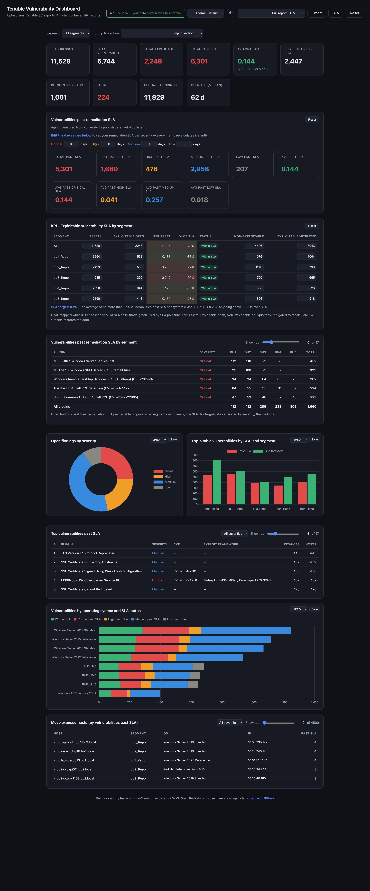

# Tenable VM Dashboard

A **100% browser-local** dashboard for Tenable Security Center (Tenable.sc) vulnerability data. Drop in your `cumulative` (open) and `mitigated` vulnerability-detail exports and get high-value, SLA-driven vulnerability-management reports instantly — **the data never leaves your browser**. No server, no upload, no SaaS.

> Open your browser's Network tab while you use it: there are **zero outbound requests** with your data, and the libraries are vendored locally — so it also runs fully offline / air-gapped.

**Live page:** https://cloudanimal.github.io/tenable-vm-dashboard/

## Why

Security teams often can't push raw scan data to a third-party tool — it's sensitive and policy frequently forbids it. This page does the entire analysis in the browser, so you get the convenience of a hosted tool with the privacy of a local one. It works in Chrome and Edge (Chromium), and with the bundled libraries it needs no internet access.

## What it reports

- **Executive KPIs** — IP addresses, total vulnerabilities, total exploitable, total/avg past-SLA, published > 1yr, first-seen > 1yr, Log4j, mitigated count, and median open age. Each card has a hover tooltip explaining its calculation.
- **Vulnerabilities past remediation SLA** — configurable per-severity day targets (aged from `vulnPubDate`); total and per-severity past-SLA counts and per-system averages. *Every metric recalculates live as you edit the targets.*
- **Exploitable-vulnerability SLA by segment** — editable what-if table: exploitable findings per asset vs a **0.25 SLA** (avg ≤ 0.25 past-SLA vulns per system), heat-shaded by SLA pressure, with an editable "ALL" rollup.
- **Vulnerabilities past remediation SLA by segment** — a plugin × segment matrix of past-SLA findings, driven by the SLA targets.
- **Severity distribution**, **Top vulnerabilities past SLA** (severity filter + adjustable count), **Vulnerabilities by OS and SLA status** (stacked), **remediation throughput by month**, and **most-exposed hosts** (severity filter + adjustable count).

## Features

- **Segment drill-down** — filter the entire dashboard to one segment (business unit) from the top bar.
- **Jump-to-section** menu for quick navigation.
- **Light / dark mode** plus **color-blind-safe palettes** (Deuteranopia / Protanopia / Tritanopia) with light- and dark-tuned variants.
- **Configurable SLA** day targets that drive every past-SLA metric live.
- **Exports** — full report (HTML/PDF), executive Markdown, SLA summary (CSV/XLSX), top vulns, exposed hosts, breakdowns, all-summaries workbook, metrics JSON, and the full datasets. Each chart also saves as JPEG/PNG/WEBP.
- **Dynamic** — any number of business segments renders automatically (it reads the distinct `repository` values from your data).

## Input formats

The typical workflow is **two CSV exports from the same Tenable.sc `/analysis` vulndetails view** — once with `sourceType=cumulative` (open) and once with `sourceType=patched` (mitigated):

- **Cumulative (open) CSV** — current open vulnerabilities
- **Mitigated CSV** — remediated / no-longer-detected vulnerabilities

You can also load **one Excel workbook** (`.xlsx`) whose worksheet names include `cumulative` and `mitigated`, or drag in JSON. Files in the generic drop zone are auto-classified (records with `hasBeenMitigated = Yes` are treated as mitigated).

Expected columns are the standard Tenable.sc `/analysis` `vulndetails` fields (`pluginID`, `pluginName`, `severity`, `exploitAvailable`, `repository`, `ip`, `dnsName`, `operatingSystem`, `firstSeen`, `lastSeen`, `hasBeenMitigated`, `vulnPubDate`, `cve`, `vprScore`, …). Extra columns are ignored; missing ones degrade gracefully. Mitigated findings are identified by `hasBeenMitigated`, and remediation timing uses `lastSeen` (Tenable.sc doesn't export a literal remediation timestamp).

## Documentation

- **[docs/data-model.md](docs/data-model.md)** — the Tenable.sc `/analysis` schema, cumulative vs patched, and how mitigation is classified.
- **[docs/methodology.md](docs/methodology.md)** — how every metric is computed, the SLA model, and the MTTR caveats.
- **[docs/roadmap.md](docs/roadmap.md)** — planned features (month-over-month diff, agent-coverage report, companion API fetcher).

## Try it

Click **Load sample data**, or upload [`sample-data/Tenable_SC_VulnDetail_Sample.xlsx`](sample-data/Tenable_SC_VulnDetail_Sample.xlsx) — a fully synthetic dataset (18,000 hosts across 5 segments, ~6.7k open + ~11.8k mitigated findings).

## Run locally

```bash
git clone https://github.com/cloudanimal/tenable-vm-dashboard
cd tenable-vm-dashboard
python3 -m http.server 8000   # serve so "Load sample data" can fetch the bundled file
# open http://localhost:8000
```

Uploading your own files works even from `file://`; only the bundled **Load sample data** button needs the page served over HTTP.

## Tech

Single static `index.html`, no build step. [SheetJS](https://sheetjs.com) (XLSX/CSV), [PapaParse](https://www.papaparse.com) (fast CSV), and [Chart.js](https://www.chartjs.org) (charts) are **vendored in `vendor/`**, so there is no external CDN dependency and the page works offline.

## Screenshots

The full dashboard on the bundled sample data (dark theme) — executive KPIs and SLA aging, the exploitable-SLA-by-segment heat-map, the plugin × segment past-SLA matrix, severity / segment / OS charts, and most-exposed hosts (rows expand to show each host's findings):



> Generated reproducibly from the bundled sample data via `?autosample=1` — see [docs/screenshots/README.md](docs/screenshots/README.md).

## Note

The bundled sample data is entirely synthetic and does not represent any real organization or environment. The per-asset SLA and open-age metrics are approximations bounded by what the exports contain. A true remediation-time MTTR isn't shown, because Tenable.sc exports no remediation timestamp and the mitigated export is only a recent window — it needs two scans (planned compare mode). See [docs/methodology.md](docs/methodology.md).

## License

MIT
